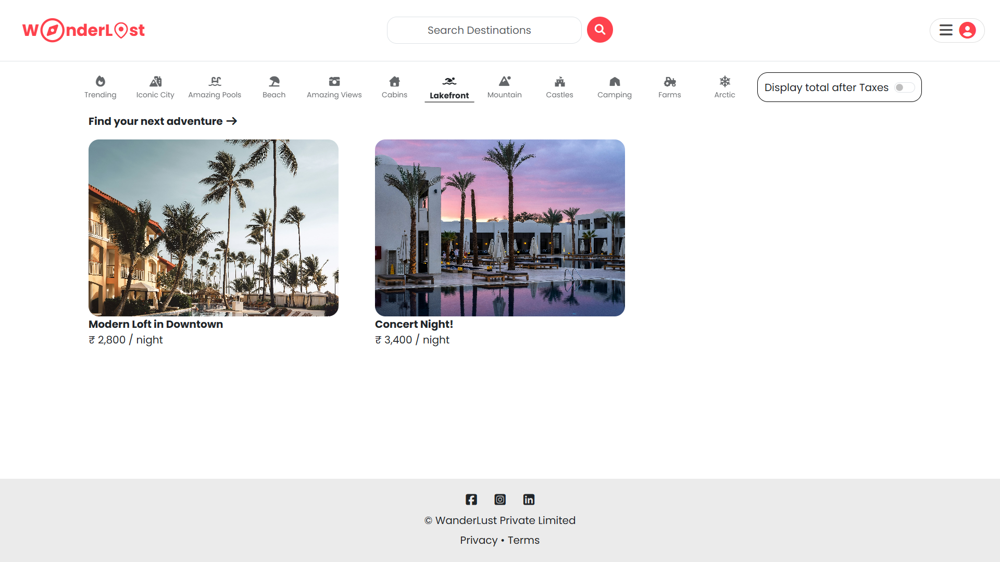

# ✈️ WanderLust

A Responsive Airbnb Clone. My first full-stack project, featuring a highly stylized UI designed for all devices.

## 🚀 Live Demo
Check out the live application here: **[ INSERT YOUR DEPLOYED LINK HERE ]**

### 🌟 Beyond the Tutorial
While this project was initially inspired by a tutorial, I have significantly expanded its capabilities, design, and architecture to build a more robust production-ready application. Here are the major custom implementations:

* **🗺️ Open-Source Map Integration (Leaflet & Nominatim)**
    * **The Challenge:** The original tutorial relied on Mapbox, which now requires credit card details for API access.
    * **My Solution:** I completely re-engineered the geolocation system using **Leaflet.js** for rendering and **OpenStreetMap (Nominatim API)** for geocoding. This ensures the project remains 100% free and open-source without sacrificing interactive map functionality.

* **🔍 Smart Search Bar**
    * A robust search algorithm that parses user queries intelligently. Whether you type a specific city, a country, or both (e.g., "Paris, France"), the backend logic separates these entities to fetch precise results.

* **🎨 Custom UI & Landing Page**
    * Deviating from the standard layout, I designed a completely unique **Home Page** with modern aesthetics and dynamic animations for a fluid user experience.
    * **Interactive User Menu:** A responsive, conditional dropdown menu that adapts based on authentication state (Guest vs. Logged-in User).

* **⭐ Custom Rating System**
    * Built from scratch using **Pure JavaScript & CSS**. No heavy external rating libraries were used, ensuring lightweight performance and complete control over the styling.

* **🏷️ Category Filters**
    * Implemented a functional filtering system (e.g., Iconic Cities, Mountains, Farms) allowing users to sort listings based on their travel interests instantly.

* **⚖️ "Junaid Advocate" Legal Pages**
    * Drafted and styled comprehensive **Privacy Policy** and **Terms & Conditions** pages to give the application a professional, real-world compliance feel.

---

### 📸 Screenshots

| **Immersive Home Page** | **Category Filters & Listings** |
|:---:|:---:|
|  |  |
| *Custom designed landing page with dynamic animations* | *Smart filtering to find specific types of stays* |

| **Interactive Maps (Leaflet)** | **User Dashboard & Menu** |
|:---:|:---:|
|  |  |
| *Open-source map implementation using Leaflet.js* | *Dynamic user controls and clean UI* |

---

### 🛠️ Tech Stack

* **Frontend:** HTML5, CSS3, JavaScript (ES6+), Bootstrap, EJS (Embedded JavaScript templates).
* **Backend:** Node.js, Express.js.
* **Database:** MongoDB, Mongoose.
* **Authentication:** Passport.js (Local Strategy).
* **Maps:** Leaflet.js, OpenStreetMap API.
* **Cloud Storage:** Cloudinary (for image storage).

---

### 📚 Learning Outcomes

Building this project as my first full-stack application helped me understand:
1.  **MVC Architecture:** Structuring code into Models, Views, and Controllers.
2.  **RESTful Routing:** creating proper CRUD operations.
3.  **Database Relationships:** Linking Users, Listings, and Reviews in MongoDB.
4.  **Middleware:** Handling authentication and server-side validation.
5.  **API Integration:** Working with Geocoding APIs and Map rendering.

---

### 🙏 Acknowledgements

This project was initially built under the guidance of **Shradha Khapra (Apna College)**.

A huge thank you to Shradha Ma'am for her incredible teaching style. Her "Sigma Batch" tutorials provided the foundation upon which I built this enhanced version. Her guidance gave me the confidence to debug errors, implement new libraries (like Leaflet), and finally call myself a **Full Stack Developer**.

---
