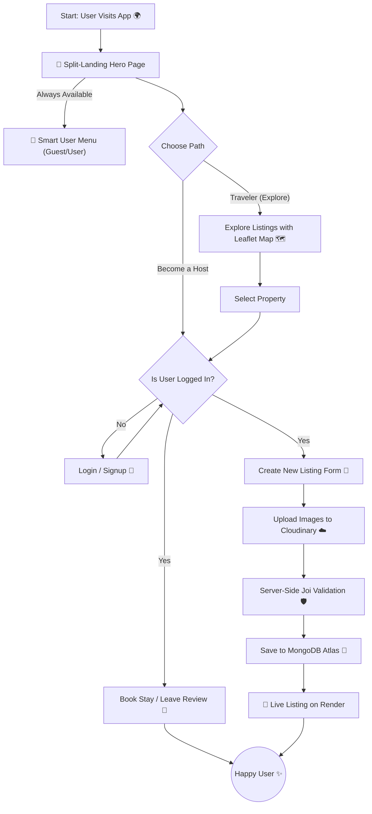

# WanderLust 🧭 – Unleash Your Journey 🗺️

WanderLust is a hotel booking web application that allows users to easily browse through various listings and reserve accommodations. It provides a clean interface for travelers to discover unique places to stay and allows hosts to list their properties for rent.

This is my first major fullstack project where I handled both the frontend and backend development. It is built as a functional clone of Airbnb and is designed with a responsive layout to ensure a seamless experience on both mobile phones and desktop computers.

<br>

## 🚀 Live Demo

Click here to explore unique stays and start your journey! 👉 [ **[ 🌏 WanderLust 🗺️ ]** ]( https://wanderlust-du5m.onrender.com )

> 💡 **Pro Tip:** Login is hassle-free! You don't need a real email ID—just create a dummy account to test features like adding reviews. 😜
>
> 😎 **Try this:** Visit the app both as a **Guest** and while **Logged In**. The interface is smart enough to detect your status and completely adapts the User Menu and features accordingly!

<br>

## 📸 Screenshots

| **Immersive Home Page** |
|:---:|
|  |
| *Custom designed landing page with dynamic animations* |

| **Curated Journeys** | **Seamless Onboarding** | **Host Opportunities** |
|:---:|:---:|:---:|
|  |  |  |
| *Immersive dark-mode interface for travelers* | *Clean split-screen UI to guide user choice* | *Dedicated flow for earning on your terms* |

<br>

## 🌟 Beyond the Tutorial
While this project was initially inspired by a tutorial, I have significantly expanded its capabilities, design, and architecture to build a more robust production-ready application. Here are the major custom implementations:

| Feature | Description |
| :--- | :--- |
| **🗺️ Map Integration** | Replaced Mapbox with **Leaflet.js & Nominatim** (OpenStreetMap) to keep the project 100% free and open-source. |
| **🧬 Advanced Init & Seeding** | Automated users, listings, images, and reviews with ownership safety and one-command database regeneration. |
| **🎨 Landing Page** | Designed a completely unique **Home Page** with modern aesthetics and dynamic animations. |
| 🎴 **Split Card** | Created a diagonal-split-Card using **CSS `clip-path`** and custom **"Double-Tap"** logic for mobile interaction. |
| **🔍 Smart Search** | Built a robust search logic that intelligently parses City and Country names from user queries. |
| **🏷️ Filters** | Implemented category-based filtering (e.g., Farms, Pools, Arctic) for easy discovery. |
| **👥 User Menu** | A smart, conditional dropdown menu that changes based on authentication state (Guest vs. User). |
| **🧑‍💻 Animated Logo** | Highly styled, custom logo using SVG icons with CSS animations to create a dynamic and engaging visual identity. |
| **⭐ Rating System** | **Pure JS & CSS** rating logic. No external libraries used for maximum performance. |
| **⚖️ Legal Pages** | Added professional **Privacy & Terms** pages ("Junaid Advocate" edition 😉). |

#### 🗺️ Why Leaflet & Nominatim?
* **The Challenge:** The original tutorial relied on Mapbox, which now requires credit card details for API access.
* **My Solution:** I completely re-engineered the geolocation system using **Leaflet.js** for rendering and **OpenStreetMap (Nominatim API)** for geocoding. This ensures the project remains 100% free and open-source without sacrificing interactive map functionality.

<br>

## 🤖 AI-Powered Workflow

**I believe in leveraging modern tools to write cleaner, faster, and more robust code.**
This project was built using an **AI-Assisted Development** workflow, treating AI not as a code generator, but as a pair programmer.

| 🛠️ Tool | 💡 How I Used It |
| :--- | :--- |
|  | **Concept Generation:** Used for brainstorming architecture (e.g., "How to handle cold-starts on Render?") and generating dummy data. |
|  | **Debugging Partner:** Used to analyze stack traces. I learned that pasting a raw error isn't enough; I have to provide context to get a fix. |
|  | **Autofill & Refactoring:** Used for boilerplate code, but applied strict manual review to ensure security and logic accuracy. |

### 🚀 Key Lessons from AI Collaboration
* **🚫 "Trust but Verify":** I learned **when to deny** AI code. AI often suggests deprecated packages or "hallucinated" variables. I manually verified every suggestion against documentation.
* **🗣️ Prompt Engineering (Bad Input === Bad Output):** I realized AI is only as smart as my instructions. Learning to write specific, context-aware prompts saved hours of debugging.
* **🧱 Bridging the Knowledge Gap:** AI helped me implement professional features I had never touched before (like **Cron Jobs** and **Leaflet Maps**) by explaining the *logic*, not just giving the code.

<br>

## 🛠️ Tech Stack

| Category | Technologies |
| :--- | :--- |
| **🎨 Frontend** |      |
| **⚙️ Backend** |     |
| **💽 Database** |    |
| **🗺️ Maps & Tools** |     |

<br>

## 🚀 Key Features
**Beyond the beautiful UI, WanderLust is built on a robust full-stack architecture.** Here is a breakdown of the complex engineering challenges powering the application.

| Category | Feature | Technical Implementation |
| :--- | :--- | :--- |
| 🧠 **Core Logic** | **Full MVC Architecture** | Built with a scalable **Model-View-Controller** pattern to keep code clean and modular. |
| 🔐 **Security** | **Authentication & AuthZ** | Secure login using **Passport.js** (Salt/Hash) 🛡️ + Middleware for strict route protection. |
| 🧪 **Data** | **Automated DB Seeding** | One-command database regeneration with realistic demo data and ownership-safe review logic. |
| 🗺️ **UX/UI** | **Interactive Maps** | Integrated **Leaflet** APIs for dynamic location pinning and geocoding 📍. |
| 📱 **Mobile** | **Touch-Optimized UI** | Custom **"Double-Tap" logic** 👆 to handle complex animations smoothly on touch devices. |
| ☁️ **Data** | **Cloud Image Storage** | Optimized image uploading and storage handling using **Cloudinary** 📸. |
| 🚧 **Safety** | **Server-Side Validation** | robust data validation with **Joi** to prevent injection attacks and ensure data integrity. |
| 💬 **Feedback** | **Flash Messages** | Real-time success/error notifications using **Express-Flash** for better user guidance ✨. |

<br>

## 📂 Project Structure
**WanderLust follows a strict MVC (Model-View-Controller) architecture to ensure scalability and code maintainability.**
```bash
WanderLust/
│
├── 📂 controllers/        👉 (Logic handling)
│   ├── 📜 listings.js
│   ├── 📜 reviews.js
│   └── 📜 users.js
│
├── 📂 init/               👉 (Database initialization & regeneration)
│   │
│   ├── 📂 advanceData/    👉 Pure seed data (NO logic)
│   │   ├── 📜 listings.js
│   │   ├── 📜 reviews.js
│   │   └── 📜 users.js
│   │
│   ├── 📜 seedUsers.js                  👉 (Bulk user creation)
│   ├── 📜 seedListingsAndReviews.js     👉 (Listings + reviews with ownership rules)
│   └── 📜 init.js                       👉 (One-command DB reset pipeline)
│
├── 📂 models/             👉 (Mongoose Schemas)
│   ├── 💽 listing.js
│   ├── 💽 review.js
│   └── 💽 user.js
│
├── 📂 node_modules/       ⚙️ (Dependencies - Git Ignored)
│
├── 📂 public/             👉 (Static Assets)
│   │
│   ├── 📂 assets/         📸 (Images & Icons)
│   │   ├── 🖼️ card-1.avif ... card-5.avif
│   │   ├── 🖼️ compass.svg
│   │   ├── 🖼️ hero.avif
│   │   ├── 🖼️ home-page.png
│   │   ├── 🖼️ map-view.png
│   │   ├── 🖼️ travel.avif
│   │   └── 🖼️ user-menu.png
│   │
│   ├── 📂 css/            🎨 (Modular Styling)
│   │   ├── 🎨 home.css
│   │   ├── 🎨 index.css
│   │   ├── 🎨 show.css
│   │   └── 🎨 style.css
│   │
│   └── 📂 js/             ✨ (Client-Side Logic)
│       ├── ✨ home.js
│       ├── ✨ index.js
│       ├── ✨ script.js
│       └── ✨ show.js
│
├── 📂 routes/             👉 (Express Routers)
│   ├── 🚦 index.js
│   ├── 🚦 listing.js
│   ├── 🚦 review.js
│   └── 🚦 user.js
│
├── 📂 utils/              👉 (Helpers)
│   ├── 🛠️ category.js
│   ├── 🛠️ ExpressError.js
│   └── 🛠️ geoData.js
│
├── 📂 views/              👉 (EJS Templates)
│   │
│   ├── 📂 includes/       🧩 (Partials)
│   │   ├── 📜 compass_icon.ejs
│   │   ├── 📜 flash.ejs
│   │   ├── 📜 footer.ejs
│   │   ├── 📜 map_pin_icon.ejs
│   │   └── 📜 navbar.ejs
│   │
│   ├── 📂 layouts/        🏗️ (Base Layout)
│   │   └── 📜 boilerplate.ejs
│   │
│   ├── 📂 listings/       🏠 (Property Pages)
│   │   ├── 📜 edit.ejs
│   │   ├── 📜 error.ejs
│   │   ├── 📜 index.ejs
│   │   ├── 📜 new.ejs
│   │   └── 📜 show.ejs
│   │
│   ├── 📂 pages/          📄 (Custom Static Pages)
│   │   ├── 📜 home.ejs
│   │   ├── 📜 privacy.ejs
│   │   └── 📜 terms.ejs
│   │
│   └── 📂 users/          👤 (Auth Forms)
│       ├── 📜 login.ejs
│       └── 📜 signup.ejs
│
├── ⚙️ .env                🔒 (Local Config - Git Ignored)
├── ⚙️ .gitignore
├── 🚀 app.js              (Entry Point)
├── ☁️ cloudConfig.js      (Cloudinary Setup)
├── ⚖️ LICENSE             (MIT License)
├── 🔒 middleware.js       (Auth Guards)
├── 📦 package-lock.json   (Dependency Tree)
├── 📦 package.json
├── 📖 README.md
└── 🛡️ schema.js           (Joi Validation)
```

<br>

## 🔄 Application Workflow
**Seamless logic meets complex architecture.** This flowchart visualizes the complete end-to-end data flow, from the custom split-landing interaction to secure cloud storage and database operations.



<br>

## 🧠 Learning Outcomes

**Building WanderLust transformed my theoretical knowledge into production-grade engineering skills.**

| 🎓 Domain | 🚀 Key Takeaways & Skills Mastered |
| :--- | :--- |
| **🏗️ Architecture** | Mastered the **MVC (Model-View-Controller)** pattern, decoupling logic to ensure the codebase is scalable and maintainable. |
| **💽 Database Engineering** | Designed complex **One-to-Many relationships** in MongoDB (connecting Users ↔ Listings ↔ Reviews) and handled cascading deletes. |
| **🤖 AI-Pair Programming** | Leveraged **Generative AI** for architectural planning, debugging complex logic errors, and optimizing documentation workflows (Prompt Engineering). |
| **🔒 Security** | Implemented robust security measures including **Session-based Authentication** (Passport.js), **Joi Validation**, and Environment Variable protection. |
| **⚡ Performance Ops** | Solved the "Cold Start" problem on Render by implementing **Cron Jobs** to keep the server active and responsive. |
| **🌐 API Integration** | Replaced paid mapping services with **Open-Source alternatives** (Leaflet + Nominatim), mastering asynchronous data handling. |

<br>

## 🪄 Installation & Setup

**Want to run this project locally? Follow these simple steps.**

**1. Clone the repository**
```bash
git clone https://github.com/JunaidUsmani2468/WanderLust.git
cd WanderLust
```

**2. Install Dependencies**
```bash
npm install
```

**3. Configure Environment Variables**<br>
Create a `.env` file in the root directory and add the following keys:
```bash
CLOUD_NAME=your_cloudinary_name
CLOUD_API_KEY=your_cloudinary_api_key
CLOUD_API_SECRET=your_cloudinary_api_secret
ATLASDB_URL=your_mongodb_connection_string
MY_SECRET=your_session_secret
```

**4. Start the Application**
```bash
node app.js
```

**5. Visit the app**
```bash
http://localhost:8080
```

**6. Database Regeneration**<br>
This project uses one shared password for all seeded demo users (defined via environment variables).
Add this to your .env file:
```bash
SEED_USER_PASSWORD=your_strong_dev_password
```

Then regenerate the database with demo users, listings, images, and reviews:

```bash
node init/init.js
```

> **⚠️ This command clears existing data and is intended for local development only.**

<br>

## 🚀 Deployment
**WanderLust is production-ready and deployed using modern cloud infrastructure.**

| Service | Role |
| :--- | :--- |
| **Render** | Full-stack hosting with **CI/CD** integration for automated deployments. |
| **MongoDB Atlas** | Managed Cloud Database ensuring high availability and data persistence 💽. |
| **Cloudinary** | Content Delivery Network (CDN) for optimized image storage and serving ⚡. |
| **Cron-job.org** | Automated "Keep-Alive" pings to prevent server sleep and eliminate cold-start latency ⚡. |
> ⚡ **Performance Note:** I configured an external **Cron Job** to ping the server every 14 minutes. This prevents the Render free-tier from "sleeping," ensuring instant load times for all users.

<br>

## 🤝 Contributing
**Open source is at the heart of this project.** While this is primarily a portfolio piece, I welcome any suggestions or optimizations!

1.  **Fork** the repository.
2.  **Create** your feature branch (`git checkout -b feature/AmazingFeature`).
3.  **Commit** your changes (`git commit -m 'Add some AmazingFeature'`).
4.  **Push** to the branch.
5.  **Open a Pull Request**.

<br>

## 🙏 Acknowledgements

**Credit where credit is due.** This project was built on the strong foundation laid by **Shradha Khapra** and the **Apna College** team.


* **The Mentor:** A massive thank you to **Shradha Ma'am** for making complex concepts like **MVC Architecture**, **Middlewares**, and **Database Relations** feel easy. Her teaching style didn't just help me copy code; it taught me how to *think* like a developer. 🧠
* **The "Sigma" Boost:** The "Sigma Batch" provided the roadmap, but her encouragement gave me the confidence to go off-road, switch to **Leaflet**, integrate **Cron Jobs**, and truly own this project. 🚀
* **The Community:** Special thanks to the open-source contributors behind Passport.js, Leaflet, and Mongoose who make tools we love.

<br>

## 📜 License
Distributed under the **MIT License**. See `LICENSE` for more information.

<br>

---

<h3 align="center">
  Made with 💖 by <a href="https://www.linkedin.com/in/junaid-developer" target="_blank">Junaid</a>
</h3>

---
