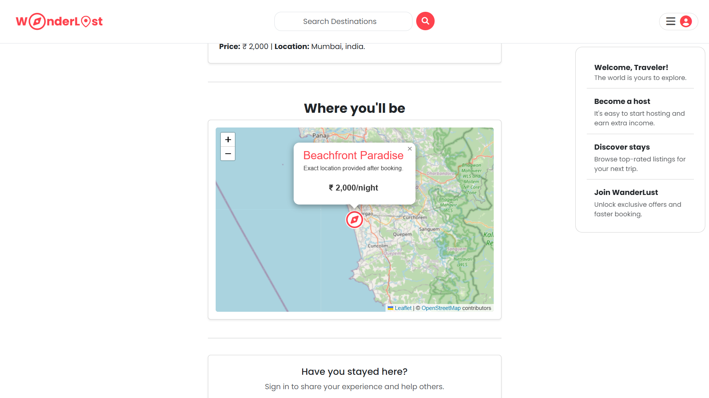
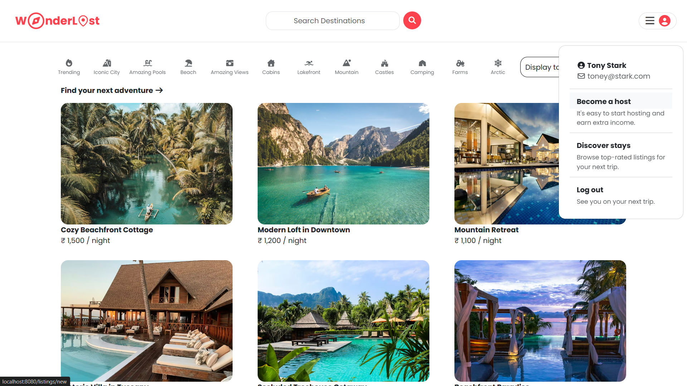
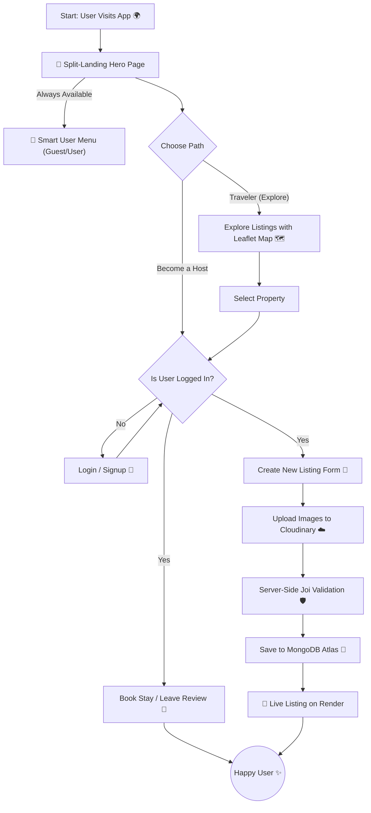

# WanderLust 🧭 – Unleash Your Journey 🗺️

WanderLust is a hotel booking web application that allows users to easily browse through various listings and reserve accommodations. It provides a clean interface for travelers to discover unique places to stay and allows hosts to list their properties for rent.

This is my first major fullstack project where I handled both the frontend and backend development. It is built as a functional clone of Airbnb and is designed with a responsive layout to ensure a seamless experience on both mobile phones and desktop computers.

## 🚀 Live Demo

Click here to explore unique stays and start your journey! 👉 [ **[ CLICK HERE ]** ]( https://wanderlust-du5m.onrender.com )

> 💡 **Pro Tip:** Login is hassle-free! You don't need a real email ID—just create a dummy account to test features like adding reviews. 😜
>
> 😎 **Try this:** Visit the app both as a **Guest** and while **Logged In**. The interface is smart enough to detect your status and completely adapts the User Menu and features accordingly!

## 🌟 Beyond the Tutorial
While this project was initially inspired by a tutorial, I have significantly expanded its capabilities, design, and architecture to build a more robust production-ready application. Here are the major custom implementations:

| Feature | Description |
| :--- | :--- |
| **🗺️ Map Integration** | Replaced Mapbox with **Leaflet.js & Nominatim** (OpenStreetMap) to keep the project 100% free and open-source. |
| **🎨 Landing Page** | Designed a completely unique **Home Page** with modern aesthetics and dynamic animations. |
| 🎴 **Split Card** | Created a diagonal-split-Card using **CSS `clip-path`** and custom **"Double-Tap"** logic for mobile interaction. |
| **🔍 Smart Search** | Built a robust search logic that intelligently parses City and Country names from user queries. |
| **👥 User Menu** | A smart, conditional dropdown menu that changes based on authentication state (Guest vs. User). |
| **🧑‍💻 Animated Logo** | Highly styled, custom logo using SVG icons with CSS animations to create a dynamic and engaging visual identity. |
| **⭐ Rating System** | **Pure JS & CSS** rating logic. No external libraries used for maximum performance. |
| **🏷️ Filters** | Implemented category-based filtering (e.g., Farms, Pools, Arctic) for easy discovery. |
| **⚖️ Legal Pages** | Added professional **Privacy & Terms** pages ("Junaid Advocate" edition 😉). |

#### 🗺️ Why Leaflet & Nominatim?
* **The Challenge:** The original tutorial relied on Mapbox, which now requires credit card details for API access.
* **My Solution:** I completely re-engineered the geolocation system using **Leaflet.js** for rendering and **OpenStreetMap (Nominatim API)** for geocoding. This ensures the project remains 100% free and open-source without sacrificing interactive map functionality.

## 📸 Screenshots

| **Immersive Home Page** |
|:---:|
|  |
| *Custom designed landing page with dynamic animations* |

| **Interactive Maps (Leaflet)** | **User Dashboard & Menu** |
|:---:|:---:|
|  |  |
| *Open-source map implementation using Leaflet.js* | *Dynamic user controls and clean UI* |

## 🚀 Key Features
**Beyond the beautiful UI, WanderLust is built on a robust full-stack architecture.** Here is a breakdown of the complex engineering challenges powering the application.

| Category | Feature | Technical Implementation |
| :--- | :--- | :--- |
| 🧠 **Core Logic** | **Full MVC Architecture** | Built with a scalable **Model-View-Controller** pattern to keep code clean and modular. |
| 🔐 **Security** | **Authentication & AuthZ** | Secure login using **Passport.js** (Salt/Hash) 🛡️ + Middleware for strict route protection. |
| 🗺️ **UX/UI** | **Interactive Maps** | Integrated **Leaflet** APIs for dynamic location pinning and geocoding 📍. |
| 📱 **Mobile** | **Touch-Optimized UI** | Custom **"Double-Tap" logic** 👆 to handle complex animations smoothly on touch devices. |
| ☁️ **Data** | **Cloud Image Storage** | Optimized image uploading and storage handling using **Cloudinary** 📸. |
| 🚧 **Safety** | **Server-Side Validation** | robust data validation with **Joi** to prevent injection attacks and ensure data integrity. |
| 💬 **Feedback** | **Flash Messages** | Real-time success/error notifications using **Express-Flash** for better user guidance ✨. |

## 📂 Project Structure
**WanderLust follows a strict MVC (Model-View-Controller) architecture to ensure scalability and code maintainability.**
```bash
WanderLust/
│
├── 📂 controllers/        👉 (Logic handling)
│   ├── 📜 listings.js
│   ├── 📜 reviews.js
│   └── 📜 users.js
│
├── 📂 init/               👉 (Database Seeding)
│   ├── 📜 data.js
│   └── 📜 index.js
│
├── 📂 models/             👉 (Mongoose Schemas)
│   ├── 💽 listing.js
│   ├── 💽 review.js
│   └── 💽 user.js
│
├── 📂 public/             👉 (Static Assets)
│   │
│   ├── 📂 assets/         📸 (Images & Icons)
│   │   ├── 🖼️ card-1.avif ... card-5.avif
│   │   ├── 🖼️ compass.svg
│   │   ├── 🖼️ hero.avif
│   │   ├── 🖼️ home-page.png
│   │   ├── 🖼️ map-view.png
│   │   ├── 🖼️ travel.avif
│   │   └── 🖼️ user-menu.png
│   │
│   ├── 📂 css/            🎨 (Modular Styling)
│   │   ├── 🎨 home.css
│   │   ├── 🎨 index.css
│   │   ├── 🎨 show.css
│   │   └── 🎨 style.css
│   │
│   └── 📂 js/             ✨ (Client-Side Logic)
│       ├── ✨ home.js
│       ├── ✨ index.js
│       ├── ✨ script.js
│       └── ✨ show.js
│
├── 📂 routes/             👉 (Express Routers)
│   ├── 🚦 index.js
│   ├── 🚦 listing.js
│   ├── 🚦 review.js
│   └── 🚦 user.js
│
├── 📂 utils/              👉 (Helpers)
│   ├── 🛠️ category.js
│   ├── 🛠️ ExpressError.js
│   └── 🛠️ geoData.js
│
├── 📂 views/              👉 (EJS Templates)
│   │
│   ├── 📂 includes/       🧩 (Partials)
│   │   ├── 📜 compass_icon.ejs
│   │   ├── 📜 flash.ejs
│   │   ├── 📜 footer.ejs
│   │   ├── 📜 map_pin_icon.ejs
│   │   └── 📜 navbar.ejs
│   │
│   ├── 📂 layouts/        🏗️ (Base Layout)
│   │   └── 📜 boilerplate.ejs
│   │
│   ├── 📂 listings/       🏠 (Property Pages)
│   │   ├── 📜 edit.ejs
│   │   ├── 📜 error.ejs
│   │   ├── 📜 index.ejs
│   │   ├── 📜 new.ejs
│   │   └── 📜 show.ejs
│   │
│   ├── 📂 pages/          📄 (Custom Static Pages)
│   │   ├── 📜 home.ejs
│   │   ├── 📜 privacy.ejs
│   │   └── 📜 terms.ejs
│   │
│   └── 📂 users/          👤 (Auth Forms)
│       ├── 📜 login.ejs
│       └── 📜 signup.ejs
│
├── ⚙️ .env
├── ⚙️ .gitignore
├── 🚀 app.js              (Entry Point)
├── ☁️ cloudConfig.js      (Cloudinary Setup)
├── 🔒 middleware.js       (Auth Guards)
├── 📦 package-lock.json   (Dependency Tree)
├── 📦 package.json
├── 📖 README.md
└── 🛡️ schema.js           (Joi Validation)
```

## 🔄 Application Workflow
**Seamless logic meets complex architecture.** This flowchart visualizes the complete end-to-end data flow, from the custom split-landing interaction to secure cloud storage and database operations.



## 🛠️ Installation & Setup

**Want to run this project locally? Follow these simple steps.**

**1. Clone the repository**
```bash
git clone https://github.com/JunaidUsmani2468/WanderLust.git
cd WanderLust
```

**2. Install Dependencies**
```bash
npm install
```

**3. Configure Environment Variables Create a .env file in the root directory and add the following keys:**
```bash
CLOUD_NAME=your_cloudinary_name
CLOUD_API_KEY=your_cloudinary_api_key
CLOUD_API_SECRET=your_cloudinary_api_secret
ATLASDB_URL=your_mongodb_connection_string
MY_SECRET=your_session_secret
```

**4. Start the Application**
```bash
node app.js
```

**5.Visit the app**
```bash
👉 http://localhost:8080
```

## 🛠️ Tech Stack

* **Frontend:** HTML5, CSS3, JavaScript (ES6+), Bootstrap, EJS (Embedded JavaScript templates).
* **Backend:** Node.js, Express.js.
* **Database:** MongoDB, Mongoose.
* **Authentication:** Passport.js (Local Strategy).
* **Maps:** Leaflet.js, OpenStreetMap API.
* **Cloud Storage:** Cloudinary (for image storage).

## 📚 Learning Outcomes

Building this project as my first full-stack application helped me understand:
1.  **MVC Architecture:** Structuring code into Models, Views, and Controllers.
2.  **RESTful Routing:** creating proper CRUD operations.
3.  **Database Relationships:** Linking Users, Listings, and Reviews in MongoDB.
4.  **Middleware:** Handling authentication and server-side validation.
5.  **API Integration:** Working with Geocoding APIs and Map rendering.

## 🙏 Acknowledgements

This project was initially built under the guidance of **Shradha Khapra (Apna College)**.

A huge thank you to Shradha Ma'am for her incredible teaching style. Her "Sigma Batch" tutorials provided the foundation upon which I built this enhanced version. Her guidance gave me the confidence to debug errors, implement new libraries (like Leaflet), and finally call myself a **Full Stack Developer**.
